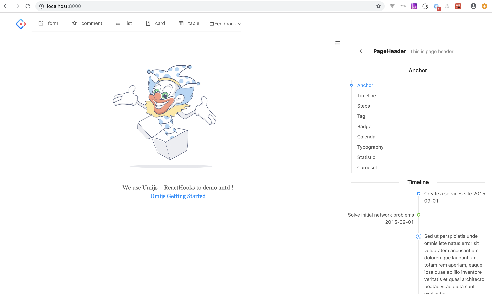

# antd-demo

> antd的示例性项目，旨在以最简方式展示antd中所有组件的使用，从而辅助学习和实践，符合所见即所得的理念。

## 使用技术

* react
* react-hooks
* antd
* umijs

## 构建脚本

```bash

node -v # v11.14.0

npm i yarn tyarn -g
tyarn -v # 1.15.2


tyarn global add umi
umi -v # 2.6.14

mkdir antd-demo && cd antd-demo
tyarn create umi
# Select the boilerplate type: app
# use typescript: n
# What functionality do you want to enable? antd/dva

```

## 启动脚本

```bash
tyarn #安装依赖

tyarn start #本地启动
```

## 示例


